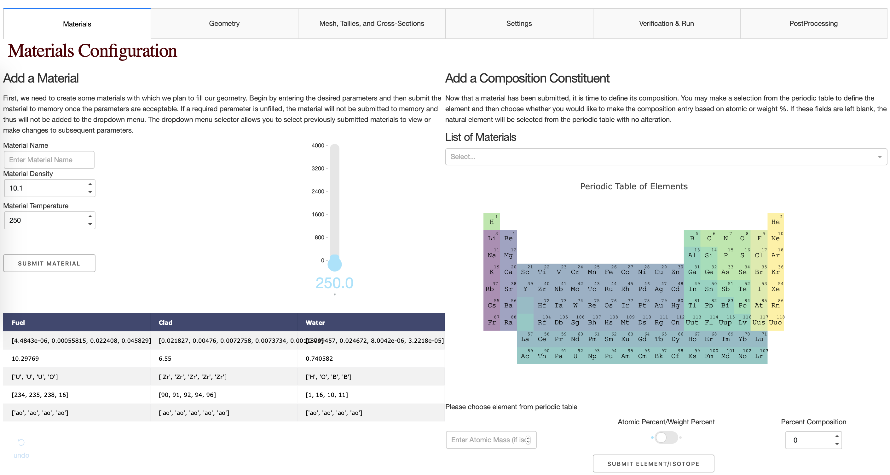
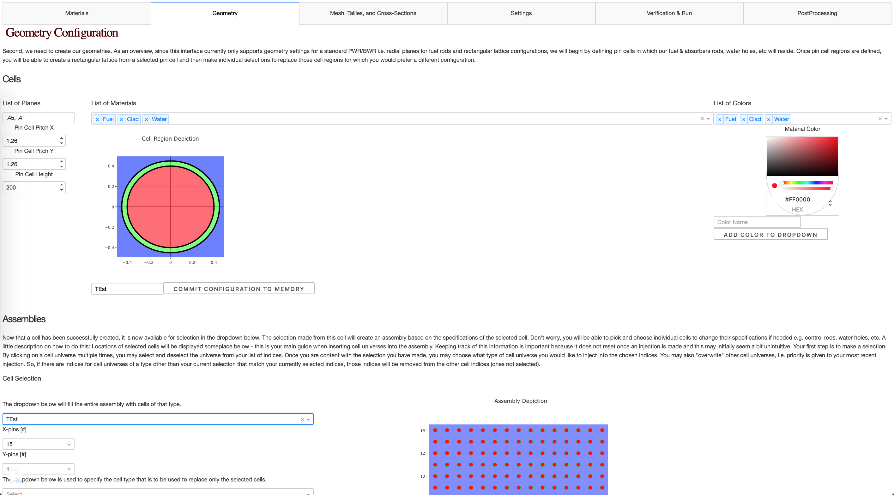
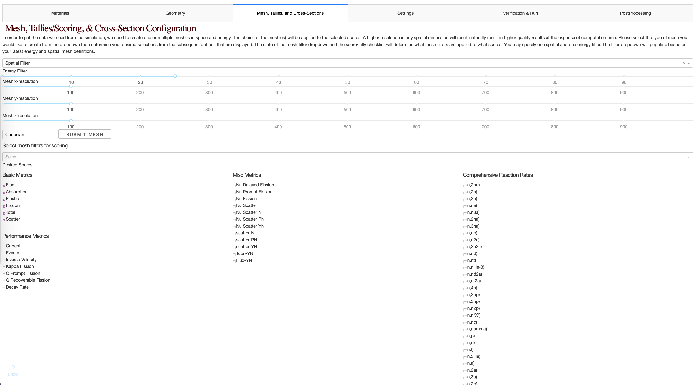
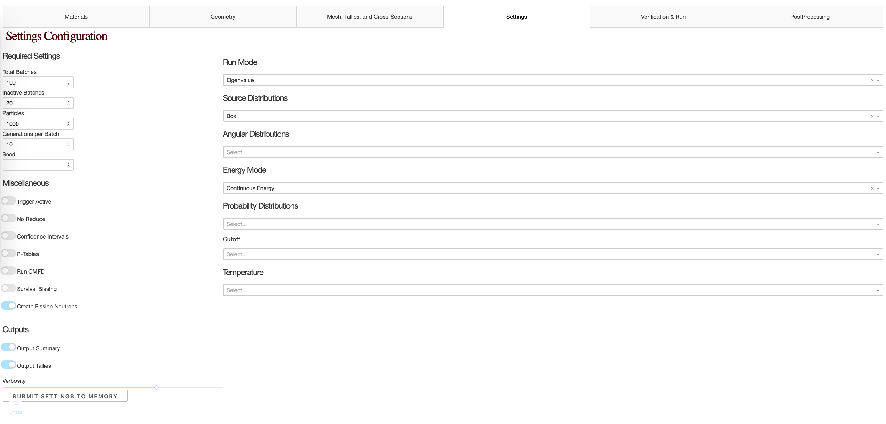
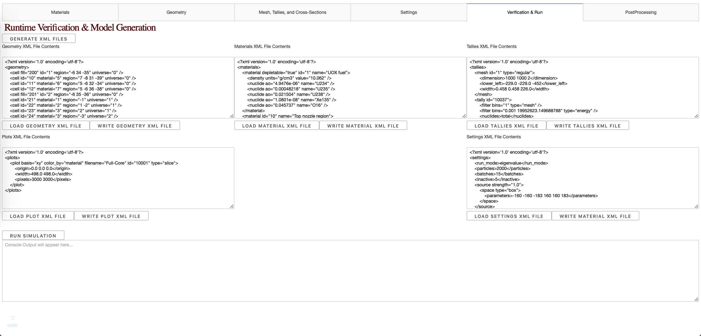
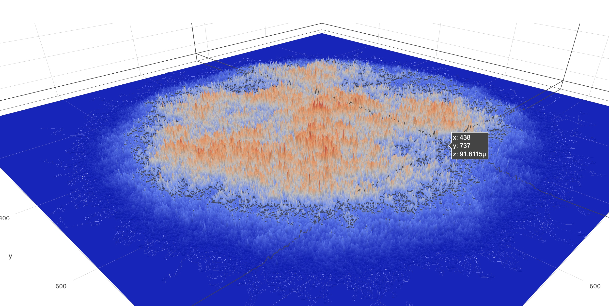

# OpenMC-Dash-Interface
#### STATUS UPDATE: Now capable of running simulations for cells and assemblies

[Heroku Demonstration](https://openmc-dash-interface.herokuapp.com/parameters/material) 
(can't run simulations on Heroku deployment until cross-sections are implemented into environment):

## Summary
This project intends to create a GUI for setting up OpenMC simulations, running them, and depicting the results. 
Dash is pythonic way of coding HTML and JavaScript with callbacks. Right now the project is segmented into several dash apps in 
the `parameters` directory. You can now run `main.py` in the project directory to get a feel for what the application will
offer. If you have any support questions, feel free to open an issue.

It is unlikely that I will be able to create support for *every* feature of OpenMC by myself so the goal right now is to 
merely get a UI working for those interested in exploring the basics of Nuclear Engineering, then maybe add support where requests 
are made. 

## Current Deployment TODO List
- Cross-sections library upload + environment variable
https://devcenter.heroku.com/articles/s3

### Current release TODO List
##### Geometry:
- Set Max Geometrical Boundaries based on Root Geometry in (%)
##### Mesh:
##### Cross-Sections:
##### Tallies & Settings:
##### Other:
- Clean up with dash multi-output support

### Next Release Features
- Post Processing
- Hexagonal Lattices
- Full Core Model -> use SELECT FEATURE (also go back and do for assemblies as well)
- Cross-Section Library Generation
    - Energy Filter Specification 
- Source Specification: https://openmc.readthedocs.io/en/stable/pythonapi/stats.html
- Finish Settings: https://openmc.readthedocs.io/en/stable/pythonapi/generated/openmc.Settings.html?highlight=openmc.Settings
- Dispersed Knowledge/Guidance

#### Unnecessary Beautification Features
- Add Loading State to Simulation: https://dash.plot.ly/loading-states
- Tweak Material Table
- Create Cross-Section Plots
- 3D Rendering of Geometry
- Graph Cell(s)/Assembly(ies) from Memory
- Add Snackbars to Alert User that configs have been accepted into data
- Always Styling

#### Questionable Features
- Removal of items from memory
- File Browser: https://github.com/uptick/react-keyed-file-browser

# Contributing
See TODO Lists

Email: sterlingbutters@gmail.com
