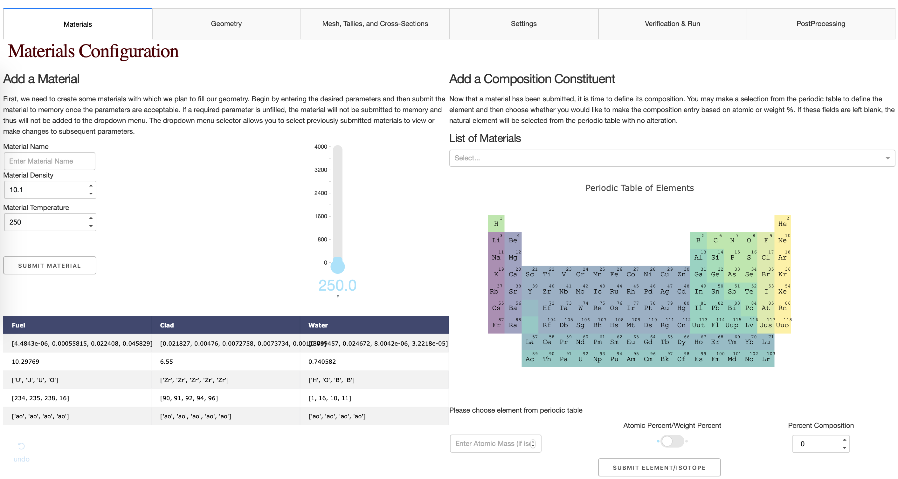
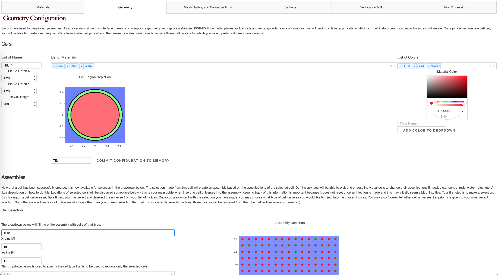
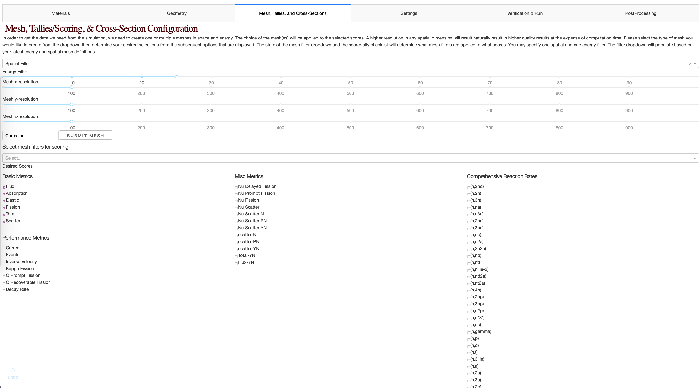
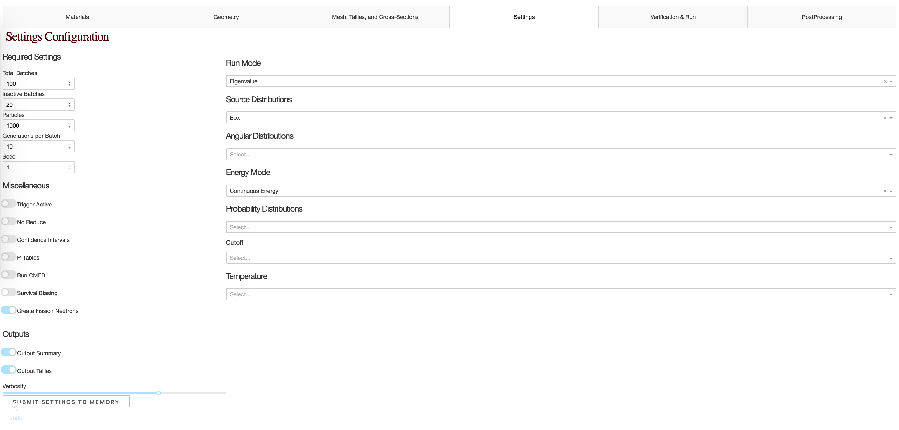
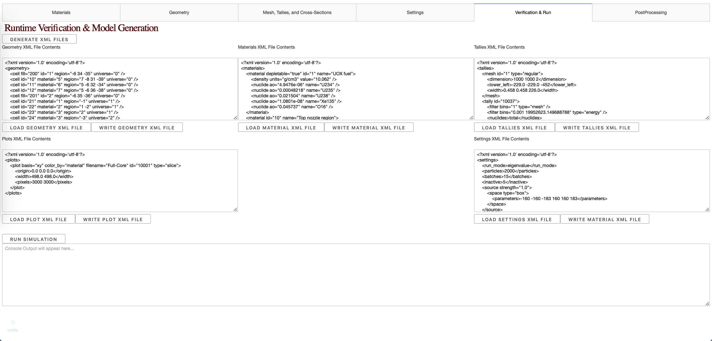
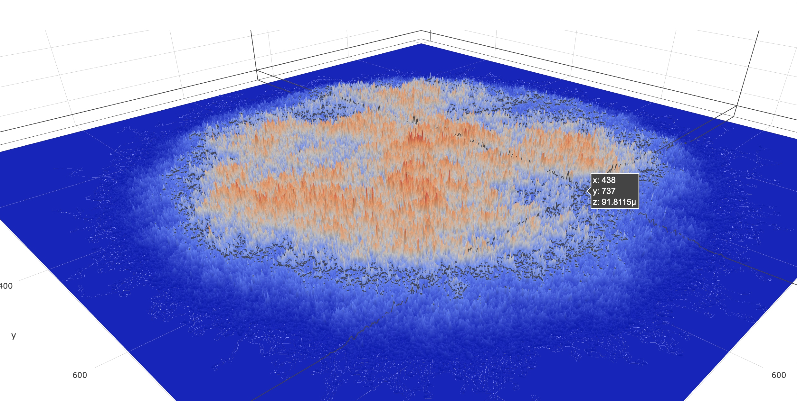

# OpenMC-Dash-Interface
Status: This project has several things that still need to be implemented but progress is coming along nicely and now 
that a basic framework has been set up, additions are become easier to implement.  

[Heroku Demonstration](https://openmc-dash-interface.herokuapp.com/parameters/material) (can't run simulations until cross-sections are implemented into environment):

## Summary
I've decided to attempt to replicate (more or less) ERSN for OpenMC (Open Source Monte Carlo Neutron Transport Code) 
but using Dash. This project will create a GUI for setting up OpenMC simulations, running them, and depicting the results. 
Dash is pythonic way of coding HTML and Js with callbacks. Right now the project is segmented into several dash apps in 
the `parameters` directory. You can now run `main.py` in the project directory (`dev` branch) to get a feel for what the application will
offer. If you have any suggestions regarding the layout, I am open to criticism and I might be able to explain the rational
for certain decisions.

It is unlikely that I will be able to create support for every feature of OpenMC by myself so the goal right now is to 
merely get a UI working for your average joe or NUEN B.S. college student, then maybe add support where requests 
are made. 

## Current Deployment Issues
- Cross-sections library upload + environment variable
https://devcenter.heroku.com/articles/s3

### Current release TODO List
##### Geometry:
- Reset Cell Indices once Injected
- Set Geometrical Boundaries based on other geometry
##### Mesh:
##### Cross-Sections:
##### Tallies & Settings:

### Next Release Features
- Full Core Model

#### Unnecessary Beautification Features
- Tweak Material Table
- Create Cross-Section Plots
- 3D Rendering of Geometry
- Graph Cell(s)/Assembly(ies) from Memory
- Add Snackbars to Alert User that configs have been accepted into data
- Other Styling

#### Questionable Features
- Removal of items from memory
